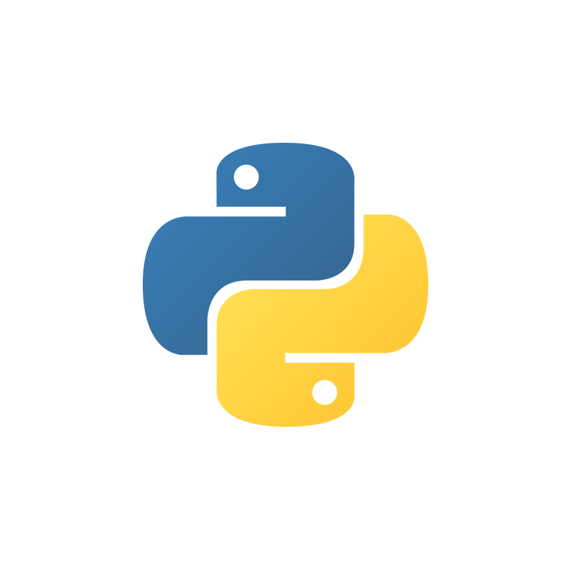

<!--
**dejanu/dejanu** is a ✨ _special_ ✨ 👋
-->
## About me

SRE 🔎 | DevOps 🚀 | Platform Engineer 🛠️
<br>
   
<br>


**📈 [CNCF openprofile](https://openprofile.dev/profile/dejanu)**

**📈 Stackoverflow** :
<br> <a href="https://stackexchange.com/users/4181863"></a>

## Latest articles:

<!-- BLOG-POST-LIST:START -->
- [No SSH? No etcdctl? Run etcdctl Instantly in Kubernetes](https://dejanualex.medium.com/no-ssh-no-etcdctl-run-etcdctl-instantly-in-kubernetes-1503e7352bfa?source=rss-29b02aa121d2------2)
- [Claude MCP: From Zero To Hero](https://dejanualex.medium.com/claude-mcp-from-zero-to-hero-a5bca458d74c?source=rss-29b02aa121d2------2)
- [Claude Code 101: An Agentic Coding Environment](https://dejanualex.medium.com/claude-code-101-an-agentic-coding-environment-88943ecededc?source=rss-29b02aa121d2------2)
- [kubectl context like a pro](https://dev.to/aws-builders/kubectl-context-like-a-pro-1gch)
- [From Zero to EKS in Minutes](https://dev.to/aws-builders/from-zero-to-eks-in-minutes-3blm)
<!-- BLOG-POST-LIST:END -->

---

```bash
                                   .-"-.            .-"-.            .-"-.                     .-"-.
                                 _/_-.-_\_        _/.-.-.\_        _/.-.-.\_                 _/.-.-.\_
                                / __} {__ \      /|( o o )|\      ( ( o o ) )               ( ( o o ) )
                               / //  "  \\ \    | //  "  \\ |      |/  "  \|                 |/  "  \|
                              / / \'---'/ \ \  / / \'---'/ \ \      \'/^\'/                   \ .-. /
                              \ \_/`"""`\_/ /  \ \_/`"""`\_/ /      /`\ /`\                   /`"""`\
                               \           /    \           /      /  /|\  \                 /       \
                               { see no evil } { hear no evil } { speak no evil }    { it works on my machine }                                                     
```


